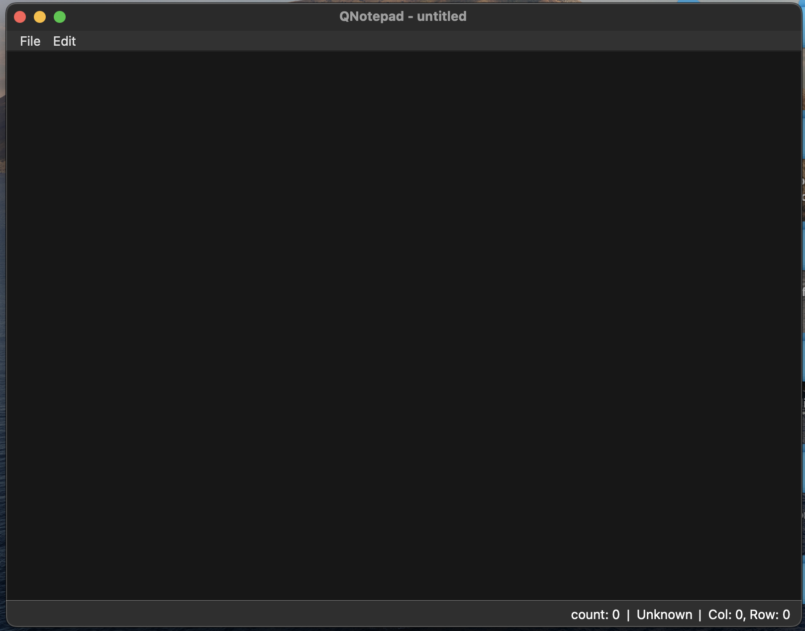

# QNotepad

QNotepad is a simple text editor which is indent to provide a fast and easy notpad like Windows'.

## Screenshot



## Config

Config file should be put in `<CONFIG_PATH>/config.json`.
`<CONFIG_PATH>` please refer to [`QStandardPaths::AppConfigLocation`](https://doc.qt.io/qt-6/qstandardpaths.html).

Sample config is below. To be aware, the `wordWrap` pair is valid only when `lineWrap` is `true`, or it will be ignored..

```json
{
    "font": [ "Consolas", "Courier New", "Courier", "monospace" ],
    "fontSize": 17,
    "nativeTitleBar": true,
    "lineWrap": true,
    "wordWrap": true
}
```
